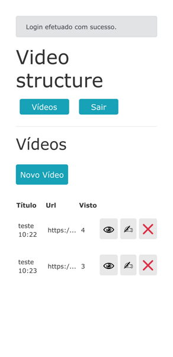
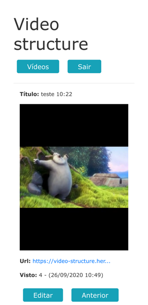

# Video Structure

## Informações:
Sistema de visualização de vídeos desenvolvido com o propósito de entregar projeto para processo seletivo em tempo restrito.

Esse projeto teve o intuito de sanar os requisitos estipulados como:
* Hospedar no Heroku
* Uso de Rails
* Uso de Github/Gitlab
* Sistema de login
* Politicas de acesso e modificação de arquivos
* Possibilitar que um video postado possa ser visualizado por qualquer usuário
* Uso de recursos como manipulação da reprodução do video no front-end
* Contador de visualizações
* Uso de biblioteca de player no front-end
* Entre outros...

O Sistema se encontra em estágio inicial de desenvolvimento.

Algumas propostas futuras de desenvolvimento seriam:
* Limpar melhor o código
* Enxugar partes do código
* Implementar mais testes
* Possivel refatoração de front-end
* entre outros...

## Tecnologias envolvidas no projeto:
* Ruby
* Rails
* HTML
* CSS
* JavaScript
* BootStrap
* Rspec
* Rubocop
* FactoryBot
* SimpleCov
* Devise
* PostgreSQL
* Linux
* I18n
* Github/Gitlab
* m3u8
* CarrierWave
* Rack-cors
* Heroku
* ffmpeg

- counter proprieties, based on: https://github.com/filhodoto/videojs-counter-plugin

- Obs: Por fazer uso do heroku com hospedagem gratuita, algumas limitações podem ocorrer, como ao ficar certo tempo sem receber visitas ter os arquivos enviados(videos) apagados etc.

## Sistema em ação:

